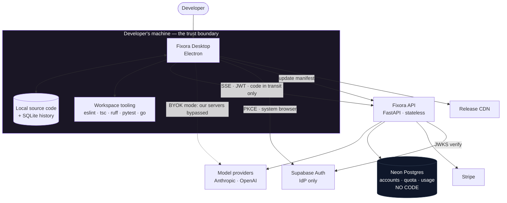
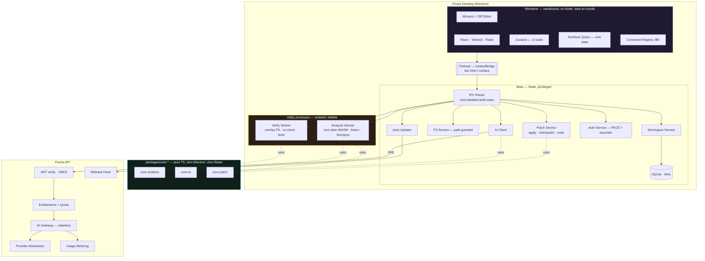
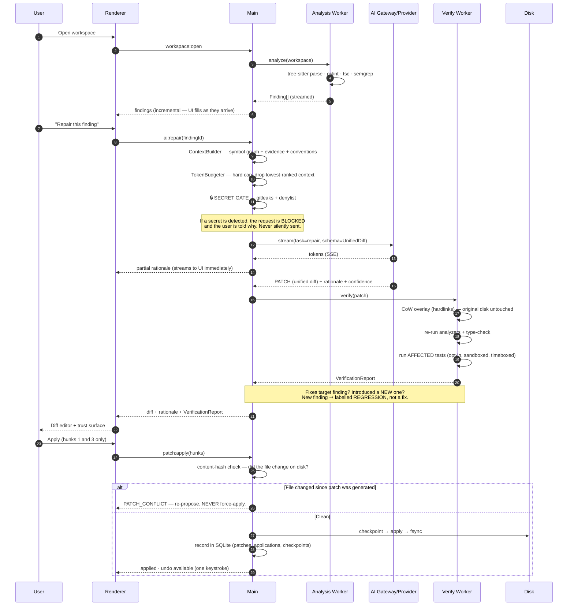
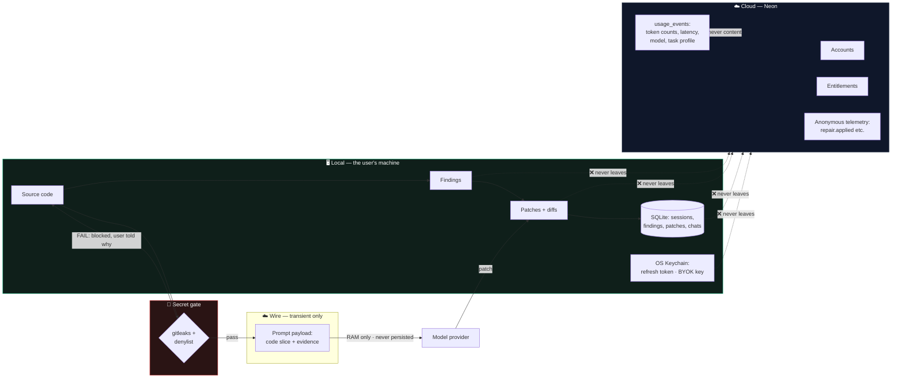
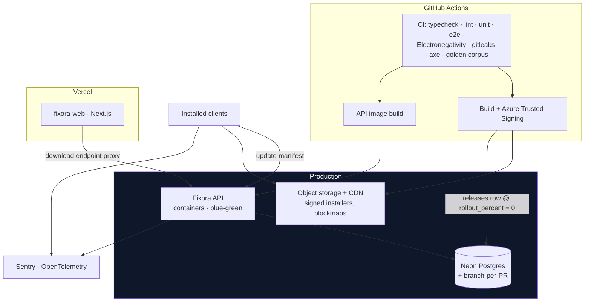

# Fixora — System Architecture & Diagrams

All diagrams are Mermaid and render in GitHub and VS Code.

---

## 1. Context (C4 Level 1)



**The line that matters:** everything inside `machine` is the user's. Source code crosses the boundary
only as a transient prompt payload, only after passing the secret gate, and in BYOK mode not through us
at all.

---

## 2. Container / component view (C4 Level 2)



**Why `packages/core-*` is drawn separately:** it is the intellectual property. It has no dependency on
Electron or React, which means (a) it is unit-testable without a display, (b) `fixora-cli` and a GitHub
Action cost weeks not quarters, and (c) an eventual Tauri migration would be a *shell* rewrite, not a
*product* rewrite. A lint rule forbids importing `electron` or `react` from these packages, and CI
enforces it.

---

## 3. Sequence — the repair loop (the product)



Read step 3–4 and step 12 together: **the model never sees code that hasn't passed the secret gate, and
the user never sees a fix that hasn't passed verification.** Those two gates are the product.

---

## 4. Sequence — authentication (PKCE, system browser)

```mermaid
sequenceDiagram
    autonumber
    participant U as User
    participant R as Renderer
    participant M as Main
    participant B as System Browser
    participant S as Supabase (IdP)
    participant API as Fixora API
    participant N as Neon

    R->>M: auth:signIn
    M->>M: generate code_verifier, S256 challenge, CSPRNG state
    M->>B: shell.openExternal(authorize_url, redirect=fixora://auth/callback)
    B->>S: user authenticates (password manager · SSO · MFA all work)
    S-->>B: 302 → fixora://auth/callback?code&state
    B->>M: OS deep link (single-instance lock forwards it)
    Note over M: Loopback listener on 127.0.0.1:&lt;random&gt; is the<br/>fallback for managed Windows images where<br/>protocol registration fails. Both are shipped.
    M->>M: validate state (reject on mismatch)
    M->>S: exchange(code + code_verifier)
    S-->>M: access_token + refresh_token
    M->>M: refresh_token → OS keychain (safeStorage/DPAPI)<br/>access_token → memory only
    M->>API: GET /v1/me (Bearer)
    API->>S: fetch JWKS (cached, rotation-aware)
    API->>API: verify iss · aud · exp · signature
    API->>N: JIT-provision users row on first sight of this sub
    API-->>M: { user, plan, entitlements, featureFlags }
    M-->>R: { user, plan, entitlements }
    Note over R: The renderer NEVER receives a token.<br/>Not in memory, not in localStorage, ever.
```

---

## 5. Data flow — what crosses which boundary



**The invariant, stated once so it can be tested:** the only user content that ever crosses the machine
boundary is a *transient prompt payload*, and only after the secret gate passes. Findings, patches,
history and keys never cross it at all. `usage_events` carries **counts, not content**.

An automated test asserts that a log line or a DB write containing source code is rejected. This is not a
policy; it is a unit test.

---

## 6. Deployment view



**Staged rollout:** a release is written at `rollout_percent = 0`, promoted 5% → 25% → 100%, watching
crash-free-sessions between steps. Desktop clients in the wild **cannot be hot-fixed** — the manifest is
the only kill switch we have, so it must be ours (ADR-022).

---

## 7. The four architectural invariants

These are load-bearing. A change that violates one is wrong, however convenient.

| # | Invariant | Enforced by |
|---|---|---|
| **I1** | `packages/core-*` never imports `electron` or `react` | ESLint `no-restricted-imports`, checked in CI |
| **I2** | The renderer never holds a token, a key, or a filesystem handle | Preload exposes only the typed IPC registry; no `ipcRenderer` |
| **I3** | No payload leaves the machine without passing the secret gate | A single choke point in `core-ai`; an integration test tries to smuggle a key past it on every CI run |
| **I4** | No byte is written to the user's disk without a checkpoint | `patch.service` is the *only* writer; a test asserts undo restores byte-identical content |

</content>
</invoke>
