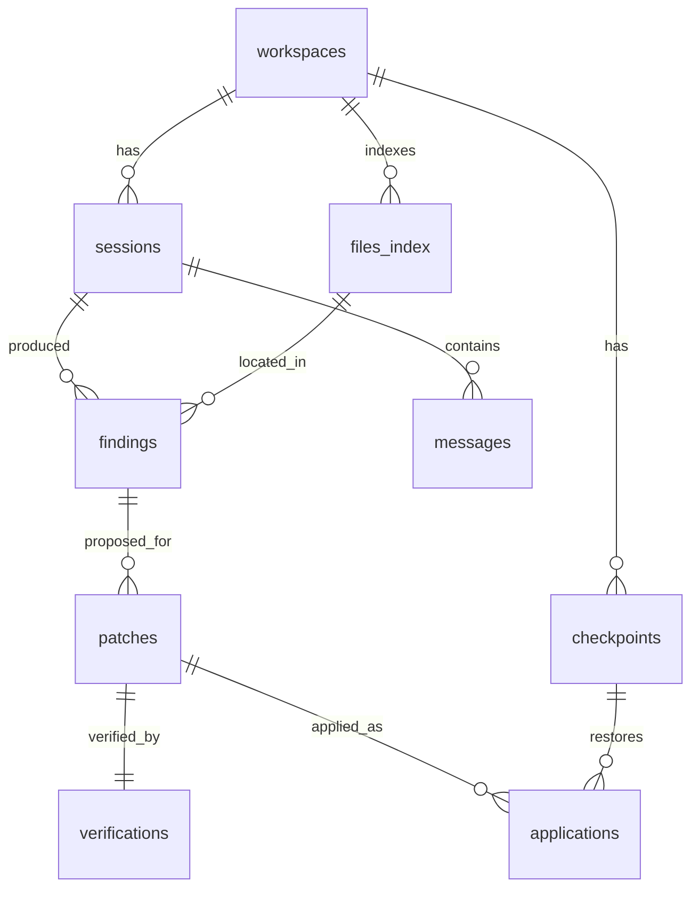
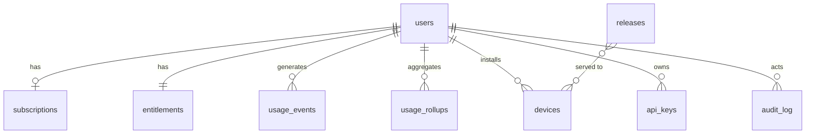

# Fixora — Database Design

Two databases with a **hard, testable line** between them:

> **Local SQLite holds everything about the user's code. Cloud Postgres holds everything about the user's
> account. Neither ever holds the other's data.**

If a column would ever contain a line of source code, a file path, a diff, or a finding message, it does
not belong in the cloud schema. This is enforced by review and by an automated schema audit in CI.

---

## 1. Local — SQLite (on the user's machine)

**Location:** `app.getPath('userData')/fixora.db` · **Mode:** WAL · **Driver:** better-sqlite3 (ADR-011)

### Tables

**`workspaces`** — `id, root_path (unique), name, last_opened_at, settings_json, created_at`
Per-workspace settings live here (not globally) because "run tests during verification" is a decision a
user makes _about a repo_, not about the app. Trusting one repo must not trust all of them.

**`files_index`** — `id, workspace_id, rel_path, language, size_bytes, mtime, content_hash, indexed_at`
`UNIQUE(workspace_id, rel_path)` · `INDEX(workspace_id, language)`
`content_hash` is the cache key for analysis, and the conflict-detection key for patches. It earns its
keep twice.

**`sessions`** — `id, workspace_id, task_profile, started_at, ended_at, status, model, trigger`
One session per user intent. The unit of history the user actually browses.

**`findings`** — `id (stable hash), session_id, file_id, source, rule_id, severity, category, start_line, start_col, end_line, end_col, message, evidence_json, fixable, confidence, resolved_at`
`INDEX(session_id, severity)` · `INDEX(file_id)`
**`findings.id` is a stable content hash** (rule + file + enclosing symbol + normalised snippet), _not_ an
autoincrement. Line numbers shift the instant a patch is applied; if the id shifts with them, we cannot
answer "did this fix resolve the finding, or did it introduce a new one?" — and that question _is_ the
product. This is the least obvious and most load-bearing detail in the local schema.

**`patches`** — `id, finding_id, session_id, unified_diff, base_content_hash, rationale_md, confidence, model, provider, tokens_in, tokens_out, created_at`
`base_content_hash` is what makes application transactional (TDD §6).

**`verifications`** — `id, patch_id, strategy, verdict, target_resolved, new_findings_json, checks_json, tests_framework, tests_run, tests_passed, tests_failed_json, duration_ms, created_at`
`verdict ∈ (verified | regression | unresolved | inconclusive)` — `inconclusive` is a first-class value.

**`applications`** — `id, patch_id, checkpoint_id, hunks_applied_json, applied_at, reverted_at`
`reverted_at` is our **quality alarm**: a fix reverted within minutes of being applied means "verified"
lied. It is a metric we watch, locally aggregated and reported (as a count, never with content) if
telemetry is on.

**`checkpoints`** — `id, workspace_id, created_at, files_json, storage_ref, expires_at`
Content-addressed blobs on disk, GC'd after 30 days. **Nothing is written to the user's disk without one.**

**`messages`** — `id, session_id, role, content, tokens, created_at` (assistant history)

**`schema_migrations`** — `version, applied_at, checksum`

### Migration policy

Forward-only, numbered, in a transaction, **with a file backup taken first**. Backward-tolerant for one
version, so a user who rolls back an update (ADR-022) does not find a database their older app cannot read.

**A corrupted local DB must degrade to "history unavailable" — never to "the app won't launch."** On a
failed integrity check: back up the file, recreate empty, tell the user, and _keep going_. Their code is
on disk; their history is a convenience. Losing the convenience must never cost them the tool.

---

## 2. Cloud — Neon Postgres

**`users`** — `id, supabase_user_id (uuid, unique), email (citext), display_name, created_at, deleted_at, telemetry_opt_in, data_region`
JIT-provisioned on first authenticated request (ADR-009). No password column — we are not an IdP.

**`subscriptions`** — `id, user_id, stripe_customer_id, stripe_subscription_id, plan, status, current_period_end, seats, cancel_at_period_end`

**`entitlements`** — `user_id (PK), plan, monthly_token_limit, concurrent_requests, byok_enabled, local_models_enabled, feature_flags (jsonb)`
Denormalised deliberately: this is read on **every AI request** and must be one indexed lookup, never a
join across billing state. Billing changes write here; the request path only reads.
`feature_flags` is also where **per-profile kill switches** live (ADR-027).

**`usage_events`** — `id, user_id, ts, task_profile, provider, model, input_tokens, output_tokens, cached_tokens, cost_micros, latency_ms, status, client_version, workspace_hash`
`INDEX(user_id, ts DESC)` · monthly partitions.
`cost_micros` is integer micro-dollars — **never a float.** Money in floats is how you get a reconciliation
bug you can't find.
`workspace_hash` is a **salted** hash, so we can count "how many distinct repos does this user work on"
without ever learning a path or a name. If the salt is per-user, it is not even correlatable across users.

**`usage_rollups`** — `user_id, period_start, tokens_in, tokens_out, cached_tokens, cost_micros, requests`
Quota checks read the rollup, not a `SUM()` over events. The quota check is on the hot path of every AI
request; it must be O(1).

**`byok_credentials`** — `id, user_id, provider, ciphertext, key_version, created_at`
**Empty by default.** BYOK keys live in the OS keychain. This table exists _only_ for users who explicitly
opt into cross-device key sync, and then only envelope-encrypted with a KMS key. **The default path never
uploads a key.**

**`devices`** — `id, user_id, platform, arch, app_version, install_id, last_seen_at`
Drives update targeting and "you're on an old version" nudges. `install_id` is random, not a machine
fingerprint — we are not in the device-tracking business.

**`releases`** — `id, channel, version, platform, arch, url, sha512, size_bytes, notes_md, published_at, rollout_percent, halted`
The kill switch (ADR-022). `halted` is a boolean an on-call human can flip in one statement at 3am, which is
exactly when they will need to.

**`api_keys`** — `id, user_id, name, key_hash, prefix, last_used_at, revoked_at` _(for `fixora-cli` / CI, later)_
Stores a **hash**, plus a display prefix. We can never show the key again, and we say so.

**`audit_log`** — `id, actor_user_id, action, target, metadata (jsonb), ip_hash, ts`
Append-only. Auth events, billing changes, key issuance, admin actions. The first thing anyone asks for in
an incident, and the last thing anyone remembers to build.

### What is _not_ here, and never will be

No source code. No file paths. No findings. No diffs. No prompts. No completions. No chat history.
**A schema-audit test in CI fails the build if a new column matches a denylist of names** (`content`,
`code`, `snippet`, `diff`, `prompt`, `completion`, `path`, `message`) without an explicit, reviewed
exemption. Policies drift; tests don't.

---

## 3. Access patterns

| Query                  | Path                                          | Requirement                                                    |
| ---------------------- | --------------------------------------------- | -------------------------------------------------------------- |
| Quota check            | `entitlements` + `usage_rollups` by `user_id` | Single indexed read. On the hot path of every AI request.      |
| Meter a completion     | Insert `usage_events`, upsert `usage_rollups` | Async, batched, **must not block the stream to the user**      |
| Update manifest        | `releases` by channel/platform/version        | Cached at the CDN; the API only computes rollout eligibility   |
| Findings for a session | Local SQLite, `INDEX(session_id, severity)`   | < 10 ms for 5k findings                                        |
| History search         | Local SQLite FTS5 over messages + rationales  | Entirely local — the cloud cannot search what it does not have |

**Metering must never block the user's stream.** If the metering write fails, the user still gets their fix
and we reconcile from the event log. Getting this backwards — failing a paid request because a stats write
timed out — is a self-inflicted outage.

---

## 4. Backups, deletion, residency

- **Neon:** PITR, and a **restore that is actually tested on a schedule.** An untested backup is not a
  backup; it is a hope with a cron job.
- **Local:** the DB is backed up before every migration. Users can export their history to JSON
  (their data, their disk, their call) and delete it in one action.
- **GDPR erasure:** a two-system delete (Supabase + Neon), hard-deleting `users` and cascading, retaining
  only anonymised `usage_rollups` for financial records. There is no code to delete, because we never had
  any — **which is the whole point, and it makes the compliance conversation with Persona 3 a short one.**
- **Residency:** `users.data_region` exists from day one even though we ship one region. Adding the column
later means a migration on a live billing table; adding it now costs one line.
</content>

</invoke>
