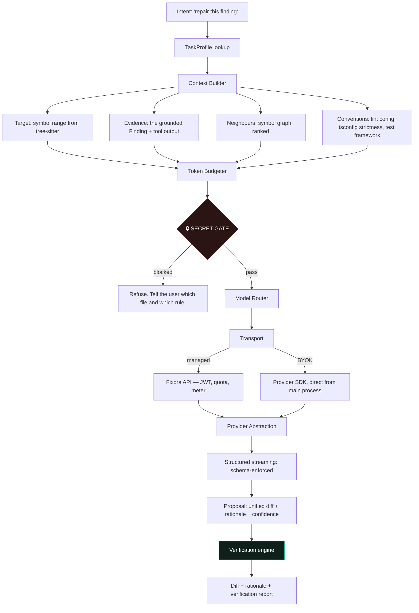

# Fixora — AI Pipeline Architecture

The pipeline is the product. Everything else is a shell around it.



---

## 1. Context building — where quality actually comes from

**The uncomfortable truth: prompt engineering is not where AI product quality lives. Context engineering
is.** Two products with identical prompts and identical models produce wildly different results based on
what they put in the window. This is the part of the system that deserves the most engineering attention
and reliably gets the least.

We build context in four layers, in priority order. When the budget is exceeded, we drop from the bottom.

| Layer              | Content                                                                      | Source              | Droppable? |
| ------------------ | ---------------------------------------------------------------------------- | ------------------- | ---------- |
| **1. Target**      | The exact symbol containing the finding, whole — never a truncated function  | tree-sitter         | **Never**  |
| **2. Evidence**    | The Finding: rule id, message, raw tool output, related locations            | Analyzer adapters   | **Never**  |
| **3. Conventions** | Lint config, tsconfig strictness, test framework, style of neighbouring code | Workspace detection | Last       |
| **4. Neighbours**  | Type definitions, imported symbols, call sites — ranked by graph distance    | Symbol graph        | First      |

**We never send whole files.** A 2,000-line file costs ~25k tokens, buries the target in noise, and makes
the model _worse_, not better. We send the enclosing symbol plus its ranked dependencies. This is cheaper
**and** higher quality — the rare case where the two align, and we should exploit it ruthlessly.

**Ranking neighbours: symbol graph first, embeddings second.** Static analysis already knows what the target
calls, what calls it, and what types it touches. That is a _precise_ answer. Embeddings give a _fuzzy_ one.
Most RAG-for-code products reach for embeddings first because it's the familiar hammer; it is the wrong
first tool when you have a compiler-grade graph sitting right there. Embeddings are our fallback for
"related but not statically connected" (similar past fixes, adjacent docs), not our primary retrieval.

### The token budgeter

```ts
interface TokenBudget {
  total: number;
  reserveForOutput: number;
  perLayer: Record<Layer, number>;
}
```

Hard caps per task profile. When context exceeds budget it **drops the lowest-ranked neighbour whole** —
it never truncates mid-symbol. A half-function in the context window is worse than no function: the model
will confidently reason about code it cannot see the end of.

`CONTEXT_OVERFLOW` is a _prevented_ error, not a _handled_ one. If the budgeter ever lets a request reach a
provider that rejects it on length, the budgeter has a bug.

---

## 2. The secret gate — the single most important 200 lines in the codebase

**Nothing leaves the machine without passing this. One choke point. No exceptions, no bypass flag, no
"just for debugging".**

```ts
// core-ai/src/gate/secret-gate.ts — every outbound payload passes through here
function gate(payload: PromptPayload): GateResult;
```

Three layers:

1. **Path denylist** — `.env*`, `.git/config`, `id_rsa`, `.pem`, `.npmrc`, `.aws/`, `.ssh/`,
   `*.key`, `credentials`, `secrets.*`. These files are never read into a prompt, at all, ever.
2. **Content scan** — gitleaks rulesets (AWS keys, GitHub tokens, private keys, JWTs, connection strings)
   over every byte of the payload, including the _evidence_ and the _neighbours_, not just the target.
3. **Entropy heuristic** — high-entropy string literals flagged and **redacted to a placeholder**, with the
   redaction visible to the user.

A blocked send produces `SECRET_DETECTED` and tells the user **which file and which rule matched**. It does
not silently proceed, it does not silently redact-and-send, and it does not offer a "send anyway" button
that a tired person clicks at 6pm on a Friday.

> **This is the control that prevents the extinction-level risk in the PRD.** One incident of Fixora
> emailing a customer's AWS key to a model provider and the company is over — not because of the damage,
> but because the entire product thesis is _"trust us with your code."_ An integration test attempts to
> smuggle a live-looking key past the gate on **every CI run**, and a failure blocks the merge.

---

## 3. Provider abstraction

```ts
interface AIProvider {
  id: 'anthropic' | 'openai' | 'google' | 'ollama';
  stream(req: ProviderRequest, signal: AbortSignal): AsyncIterable<ProviderEvent>;
  countTokens(text: string): number;
  capabilities: { structuredOutput: boolean; promptCaching: boolean; maxContext: number };
}

type ProviderEvent =
  | { type: 'text_delta'; text: string }
  | { type: 'structured_delta'; path: string; value: unknown }
  | { type: 'usage'; inputTokens: number; outputTokens: number; cachedTokens: number }
  | { type: 'error'; retryable: boolean; providerCode: string };
```

**Two live implementations from M5 (ADR-012): Anthropic and OpenAI.** An abstraction with one
implementation has silently absorbed that provider's assumptions and will shatter the day you need the
second one. Two from the start is what makes the interface real.

**Structured output is enforced by schema**, using each provider's native mechanism (tool-use / JSON mode).
We do **not** parse markdown code fences with a regex — that is a source of silent, undetectable corruption
in a system that writes to people's source files. On a schema violation: one automatic re-ask, then a loud,
typed failure.

**Failover.** Provider returns 429/5xx/timeout → retry with jitter → **fail over to the secondary provider**
and tell the user which model actually answered. This is the payoff of the abstraction and users notice it,
because everyone else's tool just breaks when a provider has a bad afternoon.

---

## 4. Model routing and cost control

**The business dies here if we're careless.** A power user on a flat plan can burn more in tokens than they
pay us. Four controls, all designed in from M5, none retrofittable cheaply:

| Control            | Mechanism                                                                             | Saving                 |
| ------------------ | ------------------------------------------------------------------------------------- | ---------------------- |
| **Routing**        | Triage/classification → cheap fast model. Repair/security reasoning → frontier model. | 40–60%                 |
| **Prompt caching** | The stable prefix (system prompt + repo conventions) is cached across turns           | 30–50% on multi-turn   |
| **Symbol-slicing** | Send the symbol, not the file (§1)                                                    | 60–80% vs naive        |
| **Grounding**      | Evidence means a _smaller_ prompt does a _better_ job — the model isn't hunting       | large, and compounding |

Plus, at the business layer: server-side quota (never client-side — the client is a JS app on the user's
machine and is not a security boundary), and **BYOK as the pressure valve**. Heavy users bring their own
key, which solves our cost problem and their privacy problem in the same stroke. **We never ship
"unlimited."**

Every request writes an `usage_events` row with `cost_micros`. We know our gross margin per user, per task
profile, **from day one** — which means we discover a margin inversion in week two, not in month nine.

---

## 5. Task profiles

```
core-ai/src/profiles/
  repair.ts       frontier · full verification · UnifiedDiff schema
  explain.ts      standard · no verification · Explanation schema
  security.ts     frontier · static verification · SecurityFinding + UnifiedDiff
  test-gen.ts     frontier · FULL verification — generated tests MUST pass before we show them
  ...             refactor · optimize · document · assistant (post-launch, ADR-024)
```

**`test-gen` deserves its own note.** A generated test that fails is not a feature, it is a chore we handed
the user. It runs in the verification sandbox and only surfaces if it _passes against the current code_ —
and, for a repair, _fails against the broken code and passes against the fix_. That second property is the
difference between a test and a decoration, and almost nobody does it.

---

## 6. Failure modes (designed for, not discovered)

| Failure                                               | Design                                                                                 |
| ----------------------------------------------------- | -------------------------------------------------------------------------------------- |
| Provider 429 / 5xx                                    | Retry with jitter → failover to secondary → surface which model answered               |
| Context overflow                                      | **Prevented** by the budgeter. If it reaches the provider, that's a bug, not an error. |
| Malformed structured output                           | Schema-validate → one automatic re-ask → typed, loud failure. Never best-effort.       |
| Stream interrupted                                    | Treated as **cancelled**. Never a partially applied patch.                             |
| Model proposes a fix that breaks tests                | **This is the system working.** Report as `regression`, do not offer apply.            |
| Model proposes a fix for a finding that doesn't exist | Impossible by construction — findings come from the grounding layer, not the model.    |
| Quota exceeded                                        | Typed error naming the next step: upgrade, or BYOK.                                    |
| A profile starts misbehaving in production            | **Server-side kill switch** (ADR-027) — desktop clients can't be hot-fixed.            |

---

## 7. Evaluation — the loop that decides whether we improve or rot

**The prompt, the context builder, and the model version are code that can regress with no compile error
and no failing unit test.** Every team building an AI product learns this the hard way, usually around
month four, when someone says "does it feel worse to you?" and nobody can answer.

**The golden corpus** (ADR-028): real broken files, known-correct fixes, across all three languages.
Scored automatically on every change to a prompt, a context strategy, a model version, or a profile.

The score is **objective and nearly free**, because we already built the scorer:

```
score = f(
  targetResolved,          ← from the verification engine
  newFindings.length,      ← from the verification engine
  testsPassed,             ← from the verification engine
  tokensSpent
)
```

**The verification engine, run in a loop, _is_ the eval harness.** That is a genuinely beautiful piece of
leverage: the same code that earns the user's trust also protects our quality over time. We should exploit
it deliberately and be smug about it.

CI fails if the corpus score regresses more than a defined threshold. **No prompt change merges on vibes.**
</content>
</invoke>
