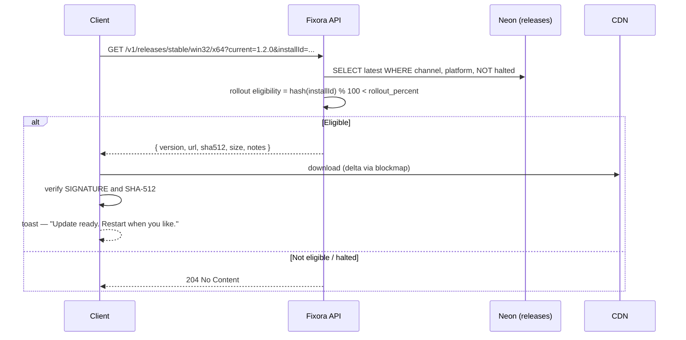

# Fixora — Packaging & Auto-Update Strategy

The install funnel is where most desktop products lose more users than any feature ever wins back. A single
"Windows protected your PC" dialog converts a curious developer into a closed tab.

---

## 1. Packaging

**`electron-builder` → NSIS, per-user install by default.**

Per-user (no admin prompt) is a **conversion decision**, not a technical one. An admin elevation prompt on
first install is a cliff: the user is now asking themselves whether they trust us enough to grant
administrator rights to software they have not yet used. Per-user install never poses the question. An MSI
for machine-wide enterprise deployment comes later, when someone is asking for it.

|  | Choice | Alternative rejected |
|---|---|---|
| Installer | NSIS, per-user | MSI-first (admin prompt kills first-run conversion) |
| Compression | maximum + blockmap | Speed over size; we optimise for download, not build time |
| Target size | **< 120 MB**, CI-enforced | Electron apps rot to 400 MB one merged PR at a time |
| Native modules | `better-sqlite3`, `electron-rebuild` in CI | Prebuilds per Electron ABI, pinned |
| Grammars | tree-sitter **WASM** | Native grammars (signing + platform matrix per grammar — no) |

**Size discipline.** Lazy-load Monaco language workers. Exclude every dev dependency from the ASAR. Ship
grammars as WASM. **Audit the bundle every release** — nobody makes an app fat on purpose; it happens because
no single PR is responsible, which is exactly why the size gate lives in CI and fails the build.

---

## 2. Code signing — Azure Trusted Signing

**~$10/month, versus $300–500/year for an EV certificate, and it inherits Microsoft's SmartScreen reputation
immediately.**

That last clause is the whole argument. An unsigned or newly-OV-signed binary shows _"Windows protected your
PC — Unknown publisher"_ to every early user. Reputation on a traditional certificate is earned over weeks
and thousands of installs — which we do not have at launch, precisely when first impressions are being formed.
Trusted Signing skips the cold-start problem entirely.

| Option | Cost | SmartScreen at launch | Verdict |
|---|---|---|---|
| **Azure Trusted Signing** | ~$10/mo | ✅ immediate | **Chosen** |
| EV cert on hardware token | $300–500/yr | ✅ immediate | Rejected — expensive, awkward in CI, token is a SPOF |
| OV cert | ~$100/yr | ❌ earned over weeks | Rejected — the weeks are the launch |
| Unsigned | $0 | ❌ scary dialog forever | Not a serious option |

> **Start the Azure identity-validation process in M0.** It takes days-to-weeks of business verification.
> Discovering that in M8, the week you meant to ship, is a self-inflicted delay — and it is exactly the kind
> of long-lead item that a "we'll do it at the end" plan always misses.

**Antivirus false positives.** Electron + a native module + a fresh signature is a recognised false-positive
shape. Submit builds to Microsoft Defender and the major AV vendors **before** launch, not after a user posts
a screenshot of a virus warning on Hacker News.

---

## 3. Auto-update

**`electron-updater` against our own release feed** (ADR-022), *not* GitHub Releases.

**Why our own feed.** A raw GitHub Releases feed gives no staged rollout and **no kill switch**. Desktop
clients in the wild **cannot be hot-fixed** — once a bad build is downloading, the only defence is to stop it
reaching everyone else. `releases.halted = true` is one UPDATE statement an on-call human runs at 3am, which
is exactly when they will need it and exactly when they will not want to be reasoning about GitHub's API.

**Staged rollout.** Every release starts at `rollout_percent = 0`. Promote 5% → 25% → 100%, watching
crash-free-sessions between steps. Eligibility is `hash(installId) % 100`, so a given user's answer is stable
across polls — a user who is in the 5% stays in the 5%, rather than flapping in and out of eligibility on
every check.

**Never restart under the user.** Download in the background; then a **non-blocking** toast. An IDE-adjacent
tool that restarts itself while someone is mid-thought is a tool that gets uninstalled. Force-restart only
for a security release, with the reason stated.

**Rollback.** Cache the previous installer. A documented downgrade path, and — critically — **local SQLite
migrations must be backward-tolerant for one version** (DB §1), or a rollback leaves the user with a database
their older app cannot open. This is the failure mode that turns a bad release into a *catastrophic* one, and
it is invisible until the day you need to roll back.

**Rehearse the rollback before launch.** A recovery procedure that has never been executed is a hypothesis.

---

## 4. Channels

| Channel | Who | Cadence |
|---|---|---|
| `stable` | Everyone | Fortnightly, staged |
| `beta` | Opt-in in Settings | Weekly, 100% immediately |

Beta users are our early-warning system, and they cost nothing. Make opting in one click, and thank them
in the release notes.

---

## 5. macOS & Linux (architected now, shipped later)

The `electron-builder` config carries all three targets from M0 — **adding them later must be configuration,
not surgery.** What's genuinely deferred is the *process*, not the architecture:

- **macOS:** Apple Developer account, notarization, hardened runtime, universal binary. Entitlements for the
  subprocesses we spawn during verification (this is the non-obvious part and it will take a day to get right).
- **Linux:** AppImage + deb. No signing story worth the name; the packaging is the easy part.

Both are gated on demand, not on ambition. Windows-first is the honest position, and the website will say so
(Design Review §2.2) rather than implying three platforms we haven't shipped.
</content>
</invoke>
